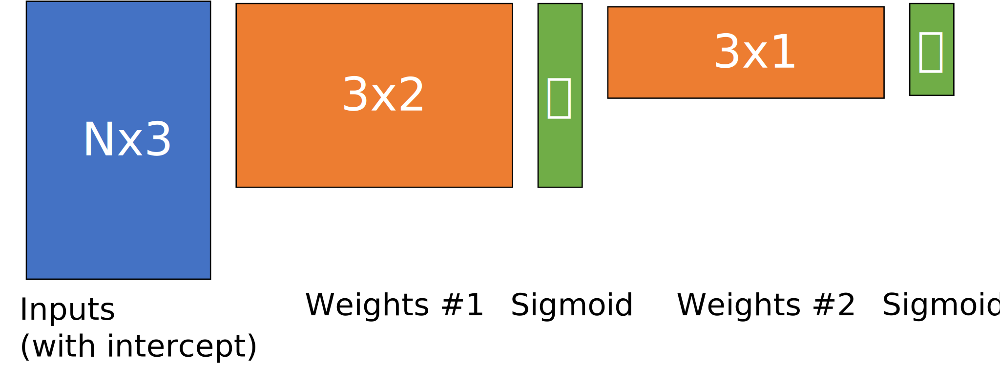

## Instructions

The setup has an earlier deadline of Thursday, February 16 at 11:59pm CST.  The
coding and free response questions are due on Thursday, February 23 at 11:59pm.

### Setup (2 points)

All you need to do for these points is pass the `test_setup` case. This
requires putting your NetID in the `netid` file and creating five PDF files
titled `XXX_qYYY.pdf` where `XXX` is replaced with your NetID, and `YYY`
ranges from 1 to 5. The content of these PDFs won't be graded, this is just to
ensure that you can set up your repository to be autograded.

There is no `password` requirement for this assignment. Your final submission
must also pass the `test_setup` test, or you will lose these points.

### Coding (10 points)

You need to write code in every function in `src/` that raises a
`NotImplementedError` exception. Your code is graded automatically using the
test cases in `tests/`.  To see what your grade is going to be, you can run
`python -m pytest`; make sure you have installed the packages from
`requirements.txt` first. If the autograder says you get 100/100, it means you
get all 10 points.

The tests build on and sometimes depend on each other. We suggest that you
implement them in the order they appear in `tests/rubric.json`. That file also
allows you to see how many (relative) points each test is worth and which other
tests it may depend on. 

You may not use `sklearn` or `scipy` to implement the functions in this
assignment. Please do not use the python internal modules or functions
`importlib`, `getattr`, or `globals`. The `test_imports` case will try to alert
you if you use this disallowed packages or functions; please do not try to
circumvent these checks. If you think the test case is erroneously penalizing
you, please make a private Piazza post.
 
The grade given to you by the autograder on Canvas is the grade you should
expect receive. If something goes wrong (your code times out, you import a
disallowed package, you accidentally push a syntax error, etc.) and you need us
to grade your code manually, we will do so but subtract a 2 point penalty.
Please be careful and read the feedback that the autograder is giving you.

Note that `test_custom_transform` may require significant trial and error and
is only worth 0.5 points towards your final grade. *Please don't spend several
hours on it.* After you've given it an initial try, please take a look at FRQ2;
you can get points for describing what you tried to do, even if you didn't pass
the test case.

Hints:
  - For all questions in this assignment, you can use any numpy function. A
    helpful numpy function is np.sign: it returns the sign of each element in
    an array. That is, -1 if the element is less than 0, 1 if the element is
    greater than 0, and 0 if the element is 0.

  - For the `test_custom_transform`, you are similarly allowed to use any numpy
    functions – e.g., np.sin, np.cos, and related functions. The output of
    your custom_transform function should be a matrix of shape (N, 3) or (N, 2),
    but each of those columns should be new features you have created.
    That is, you don’t need to copy the original (N, 2) input and only create
    one new feature – you should create 2 or 3 new features. Your choice of these
    features can and should rely on your knowledge that this function is a
    spiral. The only thing that's off limits is hardcoding the labels from
    spiral.csv into your feature transform. E.g., a trivial solution is to load
    the dataset and do a manual lookup for the label; don’t do that. You may
    find it helpful to read [this article on
    spirals](https://en.wikipedia.org/wiki/Spiral).

### Free-response (10 points)

As before and as described above, each question should be answered in its own
PDF file. We will grade these anonymously; please do not include your name,
NetID, or other personally-identifying information. We will deduct points for
this if necessary.

## Free-reponse Questions

### 1. MNIST Classification (3 points)

The [MNIST dataset](https://en.wikipedia.org/wiki/MNIST_database) is a famous
image classification dataset of handwritten digits that has been used as a
benchmark for many years. In this question, you'll train a couple models to
classify those digits and compare the results.  Look at the code provided to
you in `free_response/q1.py`, which you can run with `python -m
free_response.q1`.

Note that this FRQ requires downloading a ~15MB dataset and training models on
it. If you are running into trouble running this script, see
[`help_with_mnist.md`](help_with_mnist.md) or the hints below.

Hints for running faster:
  - In both **a.** and **b.**, you can decrease `n=10000` to a smaller number.
    This limits the size of the dataset. Note that if you limit it too much
    (e.g., n=20) you won’t be able to say anything interesting.
  - In both **a.** and **b.**, you can change `max_iter` to reduce the amount of
    training time.
  - In **a.**, you can try commenting out all the code that uses Model from
    your `src/` directory. If you did something particularly inefficient, the
    runtime of **a.** might be affected. If only using sklearn models is still
    slow, try reducing `n` or `max_iter`.

**a.** In `two_class()`, make tweaks to the dataset and hyperparameters by
editing these lines:
```python
X, y = load_digits(classes=(0, 1), n=10000)
hidden_layer_sizes = (8, )
max_iter = 200

```

Run at least eight experiments using different settings: you can change
`classes`, `n`, `hidden_layer_sizes`, and `max_iter`. You can also tweak
`build_model()` if you want. 

For each experiment you run, write down the settings you chose and the results
that are printed out.  Then, describe what trends you notice across these
experiments. Do the results match up with what we discussed in class?  Does
anything surprise you?

**b.** In `ten_class()`, experiment with changes to the sklearn MLP by editing
the following lines:
```python
hidden_layer_sizes = (32,)
max_iter = 100
sklearn_kwargs = {}
X, y = load_digits(classes=range(10), n=10000)
```

Run at least four experiments using different settings. You may want to check
the [sklearn.neural_network.MLPClassifier docs](
https://scikit-learn.org/stable/modules/generated/sklearn.neural_network.MLPClassifier.html)
to get a sense of the variety of arguments you can add into `sklearn_kwargs`.
For each experiment write down the settings you chose and the accuracies
printed out. Then, describe what trends you notice across these experiments.
What settings gave the best test set accuracy?  Did anything surprise you?

**c.** Think about why your `Model` class won't work in the `ten_class()`
function. You don't need to write any new code for this question, but you're
welcome to try things to convince yourself that your current implementation
can't handle ten-class classification. What substantial change (e.g., more than
one line of code) would you *hypothetically* have to make to the code in `src/`
so that `Model` could learn to classify ten classes of handwritten digits,
rather than just two? (Hint: using `SquaredLoss` won't work.)

### 2. Custom transform and the spiral dataset (2 points)

**a.** Were you able to pass the `test_custom_transform` case? If so,
explain what you did. If not, explain what you tried to do and why.

**b.** Run `python -m free_response.q2`; it will show a figure and save a copy
to your `free_response/` folder.  Once you've run it once, take a look at the
code in `free_response/q2.py`. Try changing the hyperparameters: the number of
hidden layers, nodes per hidden layer, activation functions, and
regularization strength or penalty.  Include in your PDF plots of at least two
decision boundaries that noticeably differ.  How did the hyperparameters you
changed influence your **test accuracy** and the decision boundaries?

**c.** Building off your experiments in **b.**, include a plot showing the
decision boundary with the best **test accuracy** you were able to achieve. What
hyperparameters did you use to achieve this accuracy? What hyperparameters had
the most effect on test accuracy?

### 3. Loss Landscapes and the Effects of Batching (1 point)

Remember from lecture that we mentioned three types of gradient descent:
"batch," which uses the entire dataset to compute the gradients; "stochastic,"
which uses only a single example at a time (as with perceptron); and "mini-batch,"
which uses a batch size in between 1 and the size of the dataset.

Read through the code in `free_response/q3.py` to understand what it's doing,
and then vary the `batch_size` command-line argument to visualize how the loss
landscape changes between batches. Run the code with `python -m
free_response.q3 <batch_size>`, where `<batch_size>` must be an integer greater
than 0 and less than 11. When you run this script, it will save figures to your
`free_response/` folder.

**a.** Choose two batch sizes greater than 0 and less than 11 such that the
standard deviation printed out in the last line of the main function is much
larger for one batch size than the other. What explains the difference between
your two choices of batch size? Include at least two plots to back up your
explanation, but you must also include a written explanation.

**b.** What do your explorations tell you about the trade-off between batch
gradient descent, minibatch gradient descent, and stochastic gradient descent?

### 4. PyTorch autograd (1 point)

While we will not use PyTorch to build neural networks in this class (but you
should take CS449 Deep Learning in spring 2023!), it and machine
learning frameworks like it make it much easier to develop custom networks than
the `src/` directory of this homework might indicate.

To get a sense of why this is, read [this PyTorch tutorial](
https://pytorch.org/tutorials/beginner/deep_learning_60min_blitz.html). You'll
certainly need to read [A Gentle Introduction to
torch.autograd](https://pytorch.org/tutorials/beginner/blitz/autograd_tutorial.html),
but the sections titled "Tensors," and "Neural Networks," and "Training a
Classifier" will be helpful. You may also find [this article on backpropagation
and automatic differentiation](
https://akashe.io/blog/2020/11/09/backpropagation-and-automatic-differentiation/)
helpful.

**a.** What benefits can we obtain by using autograd? Consider the forward()
and backward() functions that you wrote in `src/` and how Pytorch handles similar
functions.

**b.** Why does PyTorch require that most arrays and matrices be stored in its
special tensor class (`torch.Tensor`) when `numpy` arrays are very similar?

### 5. The expressive power of nonlinearities (3 points)

Recall the multilayer perceptron we saw in lecture, copied below.



We wrote the entire network as `g(g(X @ W1) @ W2)`, where `W1` is a 3x2 matrix,
`W2` is a 3x1 matrix, and `g` was the sigmoid function. `X` has two features,
but we convert it to a matrix of shape Nx3 by adding a column of 1s for the
intercept term. For this question, just assume N is 1. We also add an intercept
to `g(X @ W1)` to make it a Nx3 matrix as well.

Suppose we have:
- `X = np.array([[1, x1, x2]])`
- `W1 = np.array([[w1, w2], [w3, w4], [w5, w6]])`
- `W2 = np.array([[v1], [v2], [v3]])`

If we denote `g(X @ W1) = np.array([[1, z1, z2]])`, then `g(g(X @ W1) @ W2)` can
be written as `g(v1*1 + v2*z1 + v3*z2)`. Suppose that instead of the sigmoid function,
we let `g(x)` be a *linear* activation function, such that `g(x) = x`.

**a.** Rewrite `g(v1*1 + v2*z1 + v3*z2)` only in terms of `g, x1, x2, w1, ...,
w6, v1, v2, v3` so that its expression no longer uses `z1` or `z2`.

**b.** If we assume `g(x) = x`, can you use algebra to recombine the terms in
your answer to **a.** so that the entire network is expressed as `g(m*1 + n*x1 +
o*x2)` for some `m, n, o` that are each a function of `w1, w2, ... w6, v1, ...
v3`? If so, show how. If not, say why not.

**c.** What does this say about the expressive power of a MLP using linear
activation functions, as compared to a single linear perceptron?

**d.** Now, we'll repeat part **b.** using the sigmoid activation function,
where `g(x) = 1/(1 + np.exp(-x))`. Using this definition, can you use algebra
to recombine the terms in your answer to **a.** so that the entire network is
expressed as `g(m + n*x1 + o*x2)` for some `m, n, o` that are each a function
of `w1, w2, ... w6, v1, ... v3`? If so, show how. If not, say why not.

**e.** What does this say about the expressive power of a MLP using sigmoid
activation functions, as compared to a single sigmoid perceptron?

**f.** We mentioned in class a handful of other activation functions. For an
activation to be useful in a neural network, what are the two most important
properties it must have? One is related to this question, the other is related
to backpropagation. 
